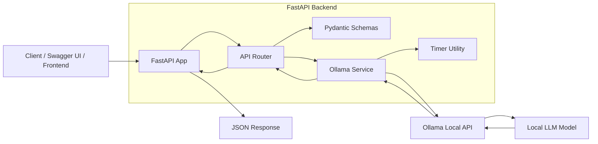
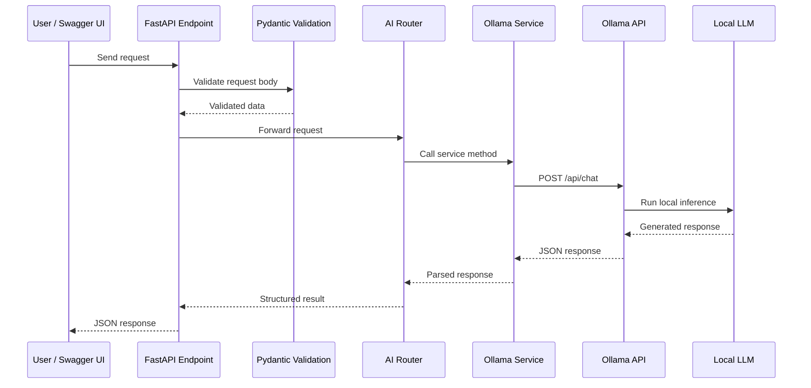
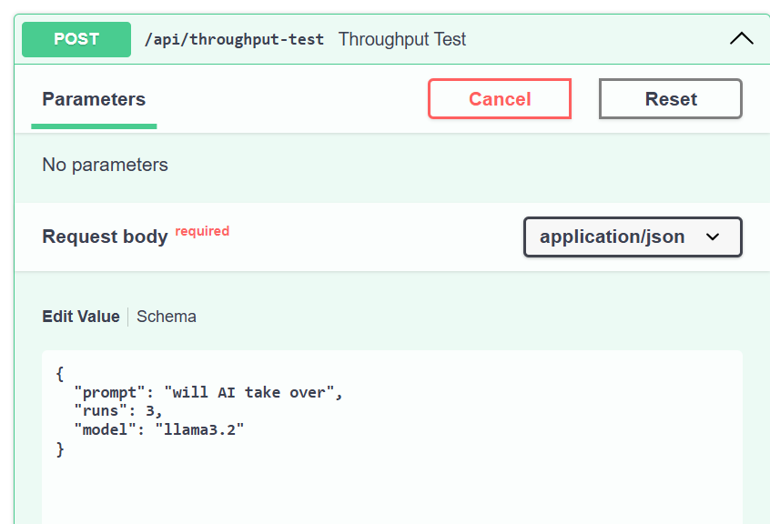
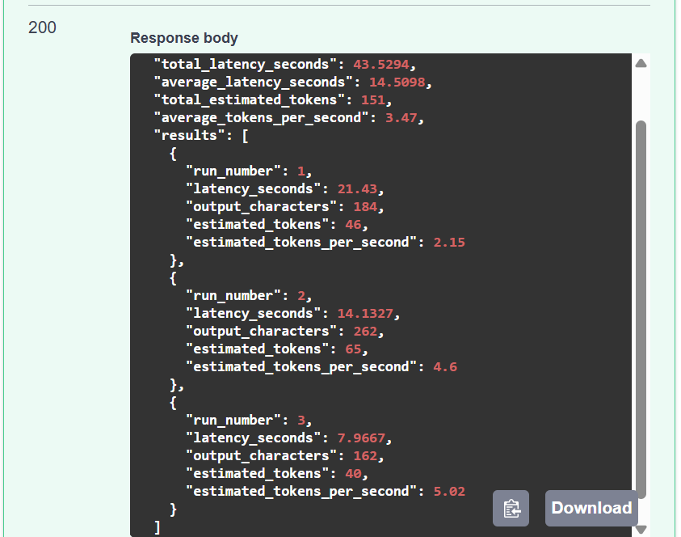
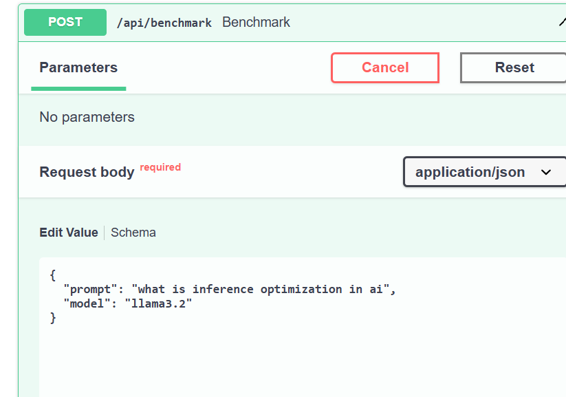
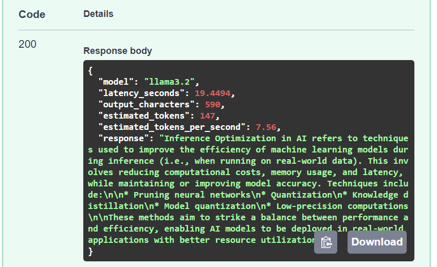
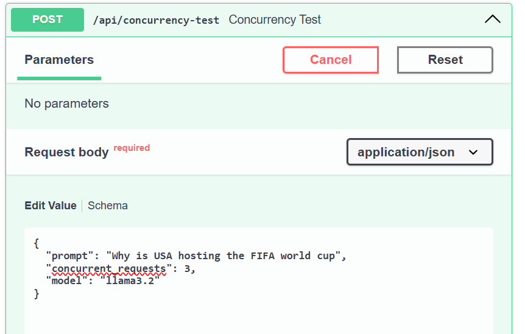
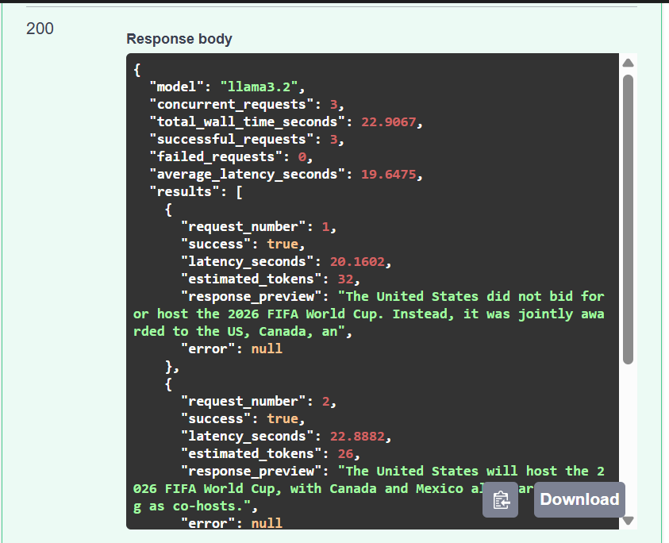
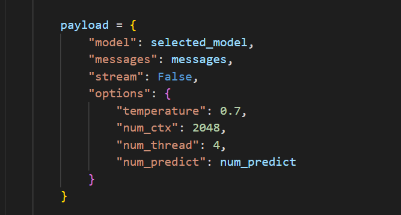

# Local LLM Gateway with FastAPI

## Overview

This is a local LLM gateway built with FastAPI and Ollama. FastAPI wraps the locally running llama language model behind multiple api endpoints that show different functionalities.

## Why did make this effort?

In most of our daily work involving the usage of LLMs, we just use the model through their hosted APIs. My actual goal was to understand how to get quicker and better responses from the model and experiment how the output differs with different system prompts. And to see how an actual backend service would work.

## My laptop specs

The processor is an intel i5 10th generation. i've got 16GBs of memory and no dedicated GPU. So the inference mode is CPU based.

## What model i used

I used the Llama 3.2(Q4 quantized). Models runs on Ollama.FastAPI sends request over HTTP to Ollama's local API and the model inference is handled by Ollama itself.

## Tech Stack

| Technology | Purpose |
|---|---|
| Python | Main programming language |
| FastAPI | Backend API framework |
| Pydantic | Request and response validation |
| Ollama | Local LLM serving layer |
| Llama 3.2 | Local language model |

## Architecture

The backend is structured into routing, validation, service, and inference layers. FastAPI handles the API layer, Pydantic validates request data, and the Ollama service sends requests to the locally running LLM.



## Request Sequence

This sequence shows how a single request moves from the user to the local model and back as a JSON response.



## API Endpoints

| Method | Endpoint | Description |
|---|---|---|
| GET | `/health` | Checks if the API is running |
| POST | `/api/chat` | Sends a user message to the local LLM |
| POST | `/api/summarize` | Summarizes long text |
| POST | `/api/analyze` | Analyzes text based on selected analysis type |
| POST | `/api/extract` | Extracts structured information from text |
| POST | `/api/benchmark` | Measures latency and estimated tokens per second for one request |
| POST | `/api/throughput-test` | Runs repeated sequential requests and reports average performance |
| POST | `/api/concurrency-test` | Sends multiple concurrent requests to test local model behavior |
| GET | `/api/models` | Lists locally available Ollama models |

## Endpoint Testing Results

### 1. Throughput Test

Endpoint:

```txt
POST /api/throughput-test
```





### 2. Benchmark

Endpoint:

```txt
POST /api/benchmark
```





### 3. Concurrency Test

Endpoint:

```txt
POST /api/concurrency-test
```





## Performance Endpoints

This project includes three performance-focused endpoints to understand local LLM inference behavior on a CPU-only machine.

### Benchmark Endpoint

The benchmark endpoint sends a single prompt to the local model and measures latency, output size, estimated tokens, and estimated tokens per second.

### Throughput Test Endpoint

The throughput endpoint sends the same prompt multiple times sequentially. It calculates total latency, average latency, total estimated tokens, and average estimated tokens per second. This helps observe warm-up behavior and consistency across repeated local inference calls.

### Concurrency Test Endpoint

The concurrency endpoint sends multiple requests at the same time using Python threads. This helps test how the local Ollama model behaves under parallel load. Since the project was tested on a CPU-only laptop, concurrency is intentionally limited to avoid overloading the system.

## Request Payload



| Field | Meaning |
|---|---|
| `model` | The Ollama model used for inference, for example `llama3.2` |
| `messages` | The chat messages sent to the model, including system and user messages |
| `stream` | Set to `false` so the API waits for the full response instead of streaming chunks |
| `temperature` | Controls randomness/creativity of the response |
| `num_ctx` | Context window size used by the model |
| `num_thread` | Number of CPU threads used for inference |
| `num_predict` | Maximum number of output tokens the model should generate |

Since the project was tested on a CPU-only i5 10th gen machine with 16 GB RAM, I used limited generation length, a 2048 context window, and 4 CPU threads to keep local inference more stable.
